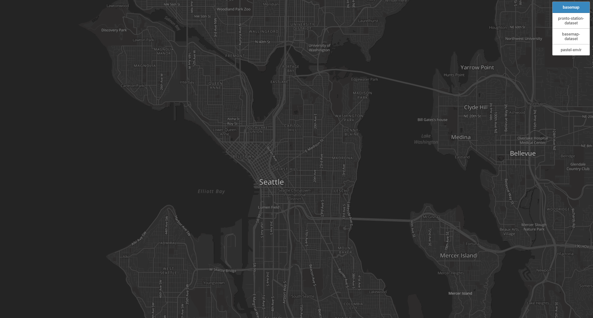
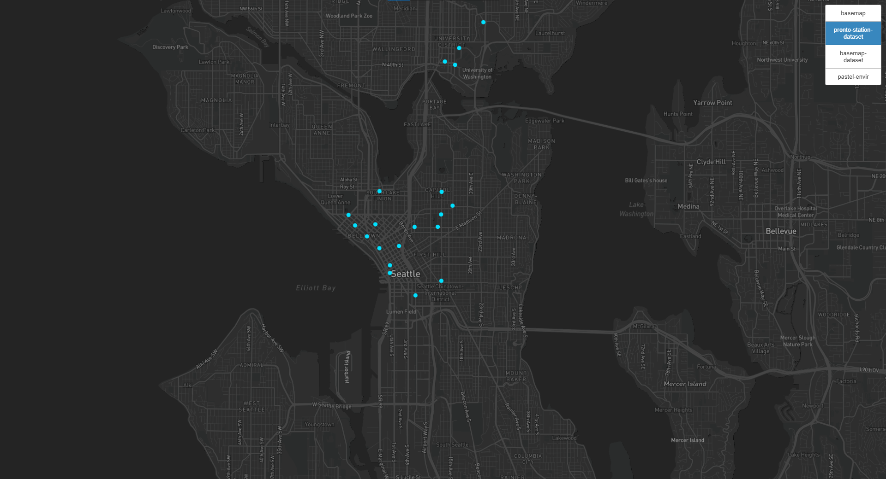
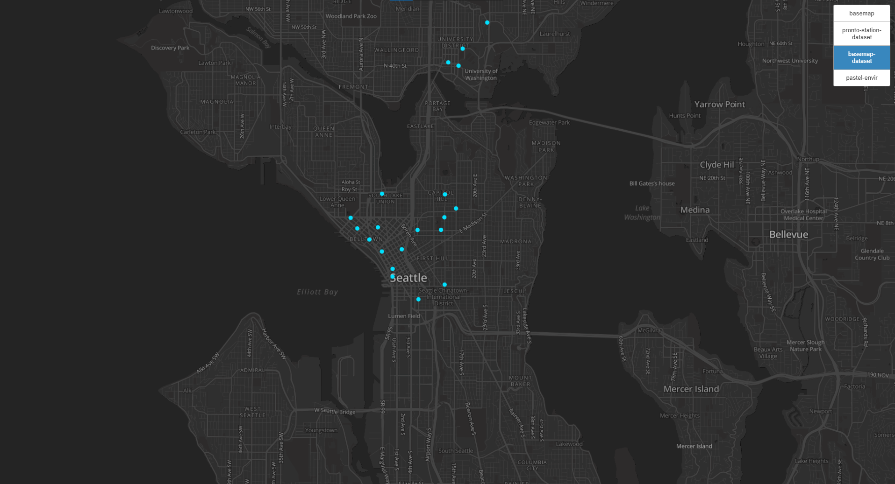
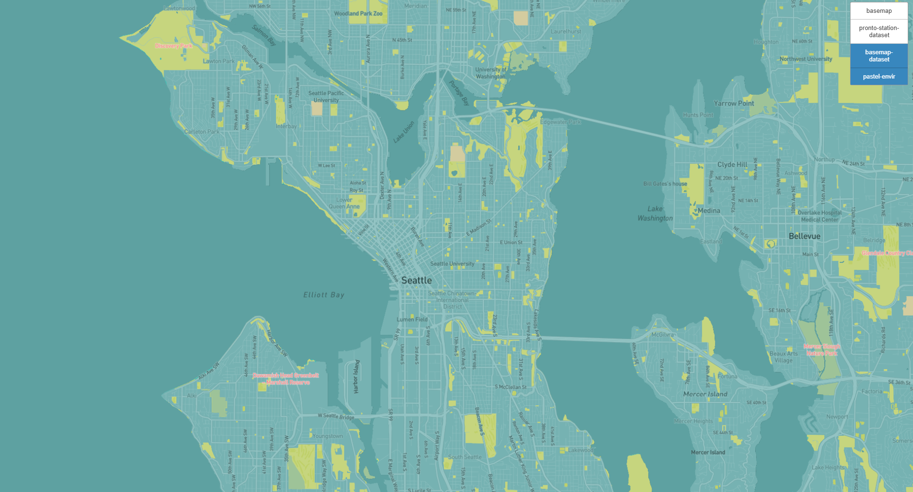

# Seattle-Map-Tiles
## For GEOG 458 Lab 4

# Tile 1 - Modified Basemap

* Modified basemap with font changes to Open Sans and size. Water color changed to a lighter grey. Streets and more points of interest displayed.

* Geographic Area: Seattle, WA and environs.

* Zoom Levels: Min - 1; Max - 14.

# Tile 2 - Pronto Dataset

* Data layer showing all Pronto Bike Stations. Data from: https://data.seattle.gov/Community/Pronto-Cycle-Share-Station-Data/ndkc-bve9

* Geographic Area: Seattle, WA

* Zoom Levels: Min - 1; Max - 14.

# Tile 3 - Basemap and Dataset Combined

* Use of tile 1 basemap and tile 2 dataset together.

* Geographic Area: Seattle, WA

* Zoom Levels: Min - 1; Max - 14.

# Tile 4 - Pastel Environment Theme

* Created using a pastel color scheme to represent soothing nature of greenspaces.

* Geographic Area: Seattle, WA and environs.

* Zoom Levels: Min - 1; Max - 14.